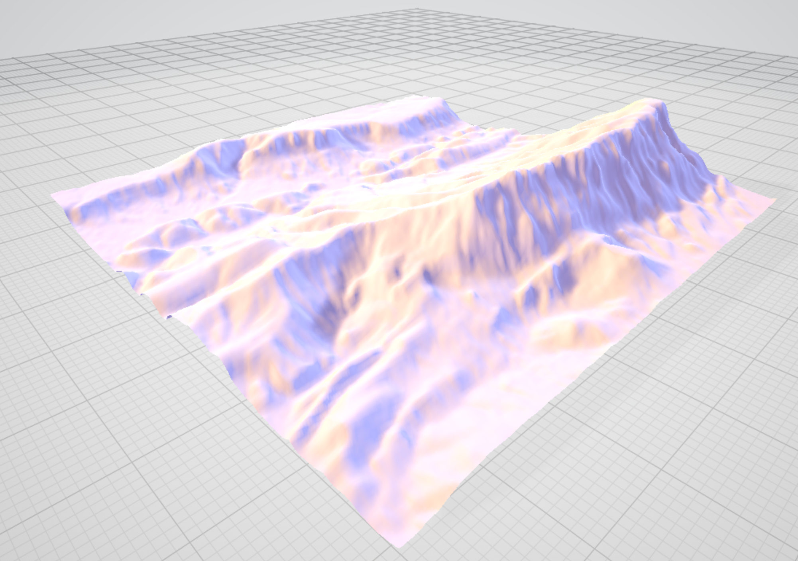

[](https://dev.azure.com/dem-net/0c1af62a-8ff1-4922-86da-d4e92c665a06/_boards/board/t/d2c48cdc-bc33-40ac-bef9-e674288c5be0/Microsoft.RequirementCategory)
# DEM-Net Samples

## Summary

*Please note that the DEM tiles will be downloaded on first run if they are not present on the local system.*

- [Elevation samples](#elevation-samples)
- [GPX Samples](#gpx-samples)
- [Dataset Samples](#dataset-samples)

## [Elevation Samples](DEMNet.Sample/Samples/ElevationSamples.cs)

### Get Elevation on SRTM_GL3 dataset from a location (lat/lng) :

```csharp
// download missing DEM files if necessary
IElevationService.DownloadMissingFiles(DEMDataSet.SRTM_GL3, lat, lon);

// get elevation
GeoPoint point = IElevationService.GetPointElevation(lat, lon, DEMDataSet.SRTM_GL3);
double? elevation = point.Elevation;
```

### Get Elevation from multiple locations at once :

*This sample get elevations for all line/DEM intersections (it can return a LOT of points).
The line can be generalized and return only points where elevation change is relevant AND keeping the local maximas.*


```csharp
IEnumerable<GeoPoint> geoPoints = IElevationService.GetPointsElevation(points, dataSet);
```

### Get line elevation : 

*This sample get elevations for all line/DEM intersections (it can return a LOT of points).
The line can be generalized and return only points where elevation change is relevant AND keeping the local maximas.*

```csharp
// Straight line crossing exactly Mt Ventoux peak
var elevationLine = GeometryService.ParseGeoPointAsGeometryLine(new GeoPoint(44.078873, 5.144899), new GeoPoint(44.225876, 5.351516));

// Download DEM tiles if necessary
IElevationService.DownloadMissingFiles(DEMDataSet.AW3D30, elevationLine.GetBoundingBox());

// Get line elevation : 1274 points !
var geoPoints = IElevationService.GetLineGeometryElevation(elevationLine, dataSet);

// Compute metrics (to get distance from origin)
var metrics = GeometryService.ComputeMetrics(geoPoints);

// Simplify line with 50m resolution
var simplified = DouglasPeucker.DouglasPeuckerReduction(geoPoints.ToList(), 50 /* meters */);

//
// Now we have only 20 points but all the peaks and coves
//
```

## [GPX Samples](DEMNet.Sample/Samples/GpxSamples.cs)

### Get elevations for a GPX track

```csharp
// Read GPX points and flatten the segments into a list of points
var gpxFile = Path.Combine("SampleData", "lauzannier.gpx");
var points = GpxImport.ReadGPX_Segments(gpxFile)
                      .SelectMany(segment => segment);

 // Retrieve elevation for each point on DEM
List<GeoPoint> gpxPointsElevated = IElevationService.GetPointsElevation(points, DEMDataSet.AW3D30)
                                        .ToList();

```

## [Dataset samples](DEMNet.Sample/Samples/DatasetSamples.cs)

A DEM.Net Dataset is a public data source of DEM files. DEM.Net supports global datasets in [OpenTopography.org](http://opentopo.sdsc.edu/lidar?format=sd&platform=Satellite%20Data).

### Get a report of all downloaded files

```csharp
IRasterService.GenerateReportAsString();
```

This will produce this nice output : 


## glTF 3D samples

```csharp
DEMDataSet dataset = DEMDataSet.AW3D30;
var modelName = $"Montagne Sainte Victoire {dataset.Name}";

// You can get your boox from https://geojson.net/ (save as WKT)
string bboxWKT = "POLYGON((5.54888 43.519525, 5.61209 43.519525, 5.61209 43.565225, 5.54888 43.565225, 5.54888 43.519525))";
var bbox = GeometryService.GetBoundingBox(bboxWKT);
var heightMap = _elevationService.GetHeightMap(bbox, dataset);

heightMap = heightMap
	.ReprojectGeodeticToCartesian() // Reproject to 3857 (useful to get coordinates in meters)
	.ZScale(2f)                     // Elevation exageration
	.CenterOnOrigin();

// Triangulate height map
var mesh = _glTFService.GenerateTriangleMesh(heightMap);
var model = _glTFService.GenerateModel(mesh, modelName);

// Export Binary model file
_glTFService.Export(model, Directory.GetCurrentDirectory(), modelName, exportglTF: false, exportGLB: true);
```



*Docs coming soon...*


## STL samples

*Docs coming soon...*

## Imagery samples

*Docs coming soon...*
